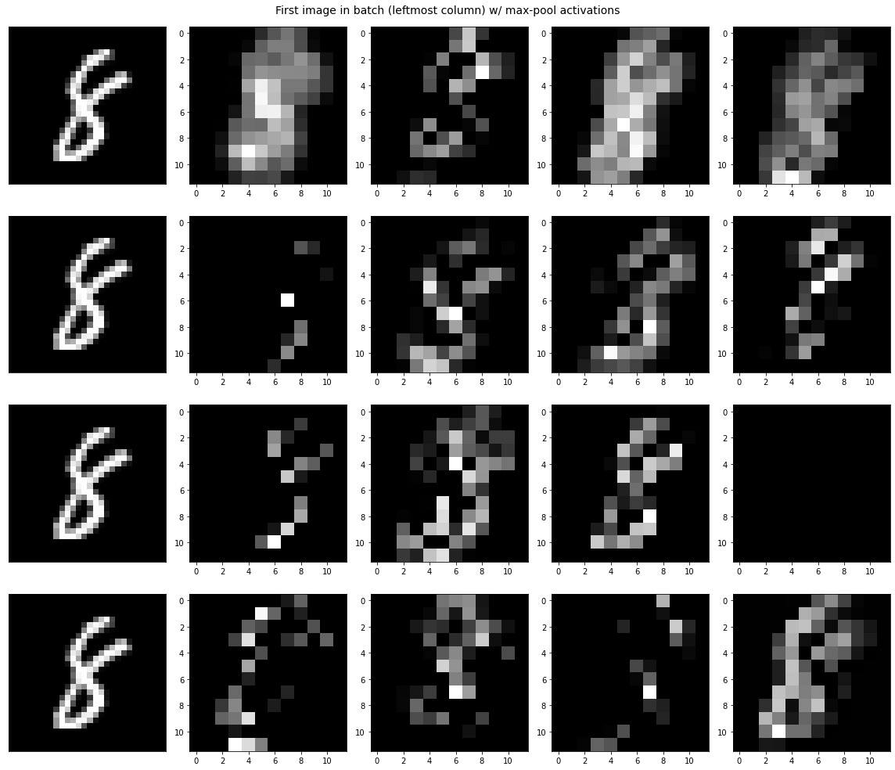

# NeuralNet Implementation

A project that aims to implement convolutional neural networks from the ground up using numpy and Python to learn backpropagation. The model was tested using the MNIST Handwritten Digits dataset for an image classification task

<i>Sample of activations from convolutional layer</i>
    

